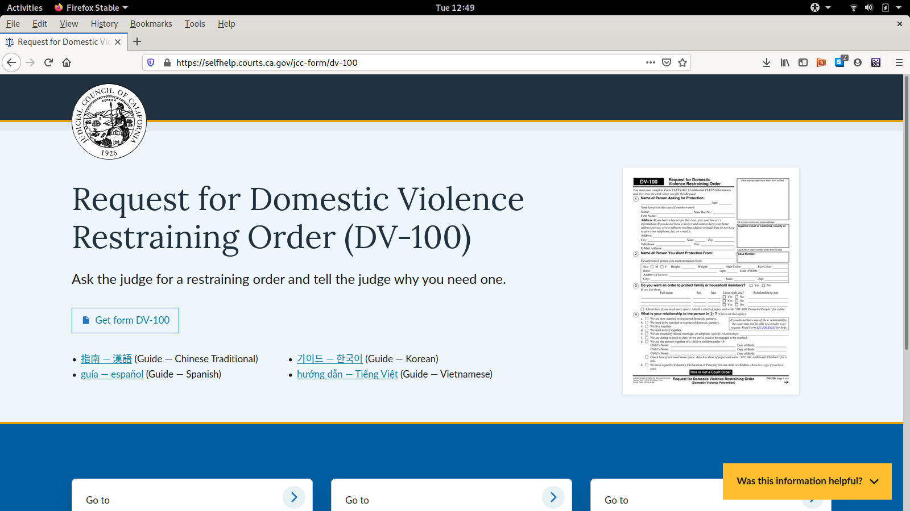

# JCC Forms Drupal Module

1. [JCC Form Media Type](#jcc-form-media-type)
2. [Form Info Pages](#form-info-pages)
3. [Forms Search API](#forms-search-api)
4. [JCC Form Category Taxonomy Term](#jcc-form-category-taxonomy-term)
5. [JCC Form Prefix Taxonomy Term](#jcc-form-prefix-taxonomy-term)
6. [A note about "translated forms" a.k.a. "form guides in other languages"](#a-note-about-translated-forms-aka-form-guides-in-other-languages)
7. [How-Tos](#how-tos)

## JCC Form Media Type

The meat of the module is the [JCC Form custom media type](https://selfhelp.courts.ca.gov/admin/structure/media/manage/jcc_form) in the SRL drupal. Every JCC form has a corresponding entity in this media type, with the exception of ["translated forms"](#a-note-about-translated-forms-aka-form-guides-in-other-languages). The source of truth for the JCC Forms data is the [jcc_forms.csv](jcc_forms.csv).

**Important: All changes to JCC Forms should be made through jcc_forms.csv. Do not use the web interface to make changes to individual forms, as those changes will be overwritten during the next migration.**

## Form Info Pages



Every JCC Form gets its own Form Info page. The goal of this page is to connect people to resources related to using a particular form (e.g. translated guides, instructions for form-filling, and self-help step-by-step guides).

### Form Info Page Files

- Twig template: [`web/themes/custom/atrium/templates/media/media--jcc-form--full.html.twig`](../../../themes/custom/atrium/templates/media/media--jcc-form--full.html.twig)
- Stylesheet: [`web/themes/custom/atrium/src/sass/components/media/_jcc-forms-full.scss`](../../../themes/custom/atrium/src/sass/components/media/_jcc-forms-full.scss)
- PHP: [`web/modules/custom/jcc_forms/jcc_forms.module`](jcc_forms.module)

## Forms Search API

The search API is a combination of:

- [a Drupal Search API index on JCC Forms](https://selfhelp.courts.ca.gov/admin/config/search/search-api/index/jcc_forms_index)
- [a JSON REST view](https://selfhelp.courts.ca.gov/admin/structure/views/view/jcc_forms_search_json_api/edit/rest_export_1)

We're using the [Drupal Search API module](https://www.drupal.org/project/search_api) with a [database backend](https://www.drupal.org/project/search_api_db), but this backend could be replaced with SOLR or any other backend.

### JCC Form Category Taxonomy Term

JCC Forms can be tagged with [JCC Form Category taxonomy terms](https://selfhelp.courts.ca.gov/admin/structure/taxonomy/manage/jcc_form_category/overview) (see [How to tag a form with a category](#how-to-tag-a-form-with-a-category)). This will cause the form to show up in the forms lookup results when someone searches for a word that matches part of the category name.

Each form category has two optional link fields: `category_form_packets_link` and `category_info_link`. These links show up in the switchboard at the bottom of every form info page for forms that have been tagged with this category.

As with forms, changes to form categories must be made in the corresponding [`jcc_form_categories.csv`](jcc_form_categories.csv) and with the [`jcc_form_category` migration](../../../../config/config-default/migrate_plus.migration.jcc_form_category.yml). Follow the steps in [How to publish updates to forms](#how-to-publish-updates-to-forms).

### JCC Form Prefix Taxonomy Term

JCC Forms are also automatically tagged with their matching [JCC Form Prefix taxonomy term](https://selfhelp.courts.ca.gov/admin/structure/taxonomy/manage/jcc_form_prefix/overview). This helps to prioritize forms in search results when people are searching for just a prefix (see [How to change the way form search results are sorted](how-to-change-the-way-form-search-results-are-sorted)).

Each form prefix has a `Form Prefix Label` field, which is what the form prefix stands for (e.g. "Family Law" for FL, or "Probate - Decedents Estates" for DE). These labels are indexed by the search API too.

Unlike every other entity type in this module, Form Prefix taxonomy terms can be added/removed/edited using [the web interface](https://selfhelp.courts.ca.gov/admin/structure/taxonomy/manage/jcc_form_prefix/overview).

## A note about "translated forms" a.k.a. "form guides in other languages"

There are JCC forms with form numbers ending in a single letter, like [FL-110 C](https://www.courts.ca.gov/documents/fl110c.pdf) or [DV-100 S](https://www.courts.ca.gov/documents/dv100s.pdf). Sometimes these are called "translated forms", and in the old forms UI, they were treated like every other court form.

These forms are different from other court forms because you can't actually file them with the court. Their only purpose is to help you fill out and file the canonical English form. For this reason, we refer to them as "form guides", and in the new UI we present them as resource links on a form's info page.

This is why they do not have their own rows in `jcc_forms.csv`.

## How-tos

### How to publish updates to forms

1) In the jcc-srl repo, update [`web/modules/custom/jcc_forms/jcc_forms.csv`](jcc_forms.csv).

2) Update [`web/modules/custom/jcc_forms/jcc_form_thumbnails.csv`](jcc_form_thumbnails.csv) and add in updated thumbnail images into [`web/modules/custom/jcc_forms/jcc_form_thumbnails`](jcc_form_thumbnails). Follow steps in [How to create form thumbnails](#how to create form thumbnails) if you need to create the form thumbnails.

3) Commit your change, push to github, and deploy to live.

4) Log in with `terminus`:

```
terminus auth:login
```

5) Run the migrations:

If there are modifications to [`web/modules/custom/jcc_forms/jcc_form_categories.csv`](jcc_form_categories.csv), run the jcc_form_category migration first:

Replace `<env>` with the name of the environment where you want to run the migration. E.g. `live` or `develop` or `pr-187`.

```
terminus drush -- jcc-srl.<env> migrate-import jcc_form_category --update
```

Then update the JCC Form thumbnails:

```
terminus drush -- jcc-srl.<env> migrate-import jcc_form_thumbnail_files --update
```

Then run the JCC Form migration:

```
terminus drush -- jcc-srl.<env> migrate-import jcc_form --update
```

6) And finally, don't forget to clear the cache

```
terminus drush -- jcc-srl.<env> cache-rebuild
```

### How to add links to translated forms

Add a link to the corresponding column in [`jcc_forms.csv`](jcc_forms.csv), then follow the steps in [How to publish updates to forms](#how-to-publish-updates-to-forms). The current language columns are: **Arabic, Cambodian, Chinese, Chinese Traditional, Farsi, Hmong, Korean, Punjabi, Russian, Spanish, Tagalog, and Vietnamese**.

### How to add form descriptions

In [`jcc_forms.csv`](jcc_forms.csv), add a one-sentence description to the column labeled **Plain language description (1-2 sentences)**, then follow the steps in [How to publish updates to forms](#how-to-publish-updates-to-forms).

### How to tag a form with a category

In [`jcc_forms.csv`](jcc_forms.csv), add a category id to the **Form category ids** column for a form, then follow the steps in [How to publish updates to forms](#how-to-publish-updates-to-forms).

A form can be tagged with as many category ids as you like, and they must be separated by a comma and a space (look at how it is done for other forms if you are confused). You are only allowed to use category ids that already exist in [`jcc_form_categories.csv`](jcc_form_categories.csv).

### How to add a new form category

Add a row to [`jcc_form_categories.csv`](jcc_form_categories.csv), then follow the steps in [How to publish updates to forms](#how-to-publish-updates-to-forms).

The **Form Category ID** and **Form Category Label** columns are required. If you want switchboard links to appear on forms tagged with this category, you can add them in the **Info URL** and **Forms Packet URL** columns.

### How to add new elements to the Form Info pages

1. **Add a new field** to [the JCC Form media type](https://selfhelp.courts.ca.gov/admin/structure/media/manage/jcc_form/fields) that will store the new information
2. **Add a new column** to [`jcc_forms.csv`](jcc_forms.csv) where people will edit this new field
3. **Update [the jcc_form migration](../../../../config/config-default/migrate_plus.migration.jcc_form.yml)** so that it maps data from the new column to the new field
4. **Update [the form info twig template](../../../themes/custom/atrium/templates/media/media--jcc-form--full.html.twig) and [the form info stylesheet](../../../themes/custom/atrium/src/sass/components/media/_jcc-forms-full.scss)** so that it renders the information in the new field somewhere on the page (see [the atrium docs](../../../themes/custom/atrium#3-atrium-installation) for how to build the stylesheet)

### How to change the way form search results are sorted

The sorting of the forms search results is configured in [the JSON REST view page](https://selfhelp.courts.ca.gov/admin/structure/views/view/jcc_forms_search_json_api/edit/rest_export_1) under `SORT CRITERIA`. At the time of writing, it is sorted first **alphabetically by form number**, and second by **search relevance**.

Search relevance is configured in [the JCC Forms Index page](https://selfhelp.courts.ca.gov/admin/config/search/search-api/index/jcc_forms_index/fields). This is where you control which fields are indexed (i.e. searchable). You can use the **boost** dropdowns to control how much the relevance score increases for each match. At the time of writing it is configured so that Form Prefix > Form Number > Form Category and Form Prefix Category.

### How to create form thumbnails

Form thumbnails can be created easily using Adobe Acrobat DC by using the unlocked PDF version. Open the form and go to File -> Export to -> Image -> JPG and save locally. Resize using a image processing program of your choice and set to 425 px width (normally thumbnails will be 425 x 550 px). Make sure the file name of the image is the form number with the .jpg extension.
